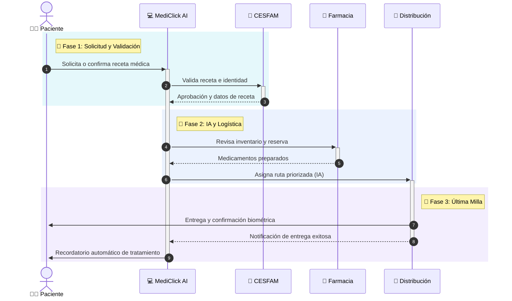

  

  

<h1 class="text-4xl font-black text-white mb-3">
  MediClick
</h1>

<h2 class="text-white/80 text-xl font-bold tracking-tight leading-snug">
  Sistema Inteligente de Gestión y Distribución de Medicamentos
</h2>

  Para Pacientes de Zonas Rurales y Personas con Movilidad Reducida.

  
Formulación de Proyectos Informáticos

  
Rafael Navarrete &nbsp;·&nbsp; Bastián Ovalle &nbsp;·&nbsp; Adriel Troncoso

---
layout: default
class: bg-grid
transition: cube-left
---

# Acto 1: El Problema

  <h3 class="text-lg font-bold text-white mb-4 flex items-center gap-2">
    <carbon-warning-alt class="text-red-500" /> Brecha de Acceso
  </h3>
  <ul class="space-y-3 text-slate-300 text-sm">
    <li class="flex gap-2">
      <carbon-close-outline class="text-cyan-400 mt-0.5 shrink-0" />
      Pacientes rurales deben viajar horas para retirar sus medicamentos en el CESFAM.
    </li>
    <li class="flex gap-2">
      <carbon-close-outline class="text-cyan-400 mt-0.5 shrink-0" />
      Personas con movilidad reducida dependen de terceros.
    </li>
    <li class="flex gap-2 text-red-400 font-bold mt-4 text-base">
      <carbon-chart-line-data class="shrink-0" />
      Alto riesgo de abandono del tratamiento (No adherencia).
    </li>
  </ul>

  
  

  

    
"La tecnología debe acercar la salud a quienes más lo necesitan, no alejarla."

  

---
layout: default
class: bg-grid
transition: cube-left
---

# Contexto, Objetivo y Alcance

  <h3 class="text-red-400 text-sm font-bold mb-2 flex items-center gap-2">
    <carbon-warning-alt /> Contexto
  </h3>
  

    En Chile, más de 2 millones de personas viven en zonas rurales o tienen movilidad reducida. Actualmente deben trasladarse al CESFAM para retirar sus medicamentos, lo que provoca abandono de tratamientos crónicos, reingresos hospitalarios evitables y sobrecarga en los centros de salud.
  

  <h3 class="text-cyan-400 text-sm font-bold mb-2 flex items-center gap-2">
    <carbon-flag /> Objetivo
  </h3>
  

    Desarrollar un sistema digital integrado que automatice la gestión de recetas médicas y la distribución de medicamentos a domicilio, reduciendo en al menos un 60% el tiempo de acceso al tratamiento para pacientes de difícil alcance.
  

  <h3 class="text-purple-400 text-sm font-bold mb-2 flex items-center gap-2">
    <carbon-list /> Alcance
  </h3>
  <ul class="text-slate-300 text-xs space-y-1.5 leading-normal">
    <li class="flex gap-1.5"><carbon-checkmark class="text-green-400 mt-0.5 shrink-0"/>Módulos: gestión de recetas, despacho, seguimiento y notificaciones</li>
    <li class="flex gap-1.5"><carbon-checkmark class="text-green-400 mt-0.5 shrink-0"/>Integración con CESFAM y farmacias piloto</li>
    <li class="flex gap-1.5"><carbon-checkmark class="text-green-400 mt-0.5 shrink-0"/>Hasta 5.000 usuarios en fase piloto</li>
    <li class="flex gap-1.5"><carbon-close class="text-red-400 mt-0.5 shrink-0"/>No incluye fabricación ni dispensación autónoma</li>
    <li class="flex gap-1.5"><carbon-close class="text-red-400 mt-0.5 shrink-0"/>No incluye integración con seguros privados</li>
  </ul>

  Tipo de proyecto: Desarrollo de Software · Modalidad: Cloud-Native

---
layout: center
class: text-center
transition: flip-y
---

<h1 class="text-4xl font-black text-transparent bg-clip-text bg-gradient-to-r from-cyan-400 to-blue-600 mb-4">
  Acto 2: La Solución
</h1>

  Un ecosistema digital integrado y automatizado.

---
layout: default
transition: cube-left
---

# Flujo Operativo Inteligente

  * El sistema prioriza automáticamente según urgencia médica, ubicación y condiciones de almacenamiento.

---
layout: two-cols
class: bg-grid
transition: wheel-rotate
---

# Acto 3: Inteligencia Artificial

  

    <h3 class="text-cyan-400 text-sm font-bold flex items-center gap-2 mb-1.5">
      <carbon-chart-evaluation /> Predicción de Demanda
    </h3>
    
Modelos de Machine Learning anticipan escasez de stock basándose en temporalidad e historial.

  

  
  

    <h3 class="text-blue-400 text-sm font-bold flex items-center gap-2 mb-1.5">
      <carbon-map /> Priorización de Entregas
    </h3>
    
Algoritmos de enrutamiento optimizan la logística considerando caminos rurales y urgencia.

  

  

    <h3 class="text-purple-400 text-sm font-bold flex items-center gap-2 mb-1.5">
      <carbon-notification /> Recordatorios Inteligentes
    </h3>
    
NLP para enviar notificaciones personalizadas vía WhatsApp/SMS para asegurar adherencia.

  

::right::

  

---
layout: center
class: text-center
transition: slide-up
---

<h1 class="text-5xl font-black text-white mb-10 drop-shadow-[0_0_20px_rgba(255,255,255,0.3)]">
  Acto 4: Alternativas de Solución
</h1>

  

    

    <h3 class="text-3xl font-black text-blue-400 mb-3 relative z-10">Alternativa 1</h3>
    
Desarrollo Propio Cloud-Native

  

  
  

    <h3 class="text-3xl font-bold text-slate-400 mb-3">Alternativa 2</h3>
    
Microsoft Power Platform

  

<v-click />

---
layout: center
transition: zoom
---

<h3 class="text-xl font-bold text-white mb-1">Alternativa 1</h3>
<h4 class="text-blue-400 text-2xl font-black mb-5">Desarrollo Propio Cloud-Native</h4>

  <logos-vue class="text-3xl drop-shadow-lg hover:scale-110 transition-transform" />
  <logos-django-icon class="text-3xl drop-shadow-lg hover:scale-110 transition-transform" />
  <logos-postgresql class="text-3xl drop-shadow-lg hover:scale-110 transition-transform" />
  <logos-docker-icon class="text-3xl drop-shadow-lg hover:scale-110 transition-transform" />
  <logos-aws class="text-3xl drop-shadow-lg hover:scale-110 transition-transform" />

<ul class="space-y-3 text-sm text-slate-200 text-left pl-4">
  <li class="flex items-center gap-3 text-green-400"><carbon-checkmark/> Máximo control, flexibilidad y escalabilidad.</li>
  <li class="flex items-center gap-3 text-green-400"><carbon-checkmark/> IA e integraciones totalmente personalizadas.</li>
  <li class="flex items-center gap-3 text-green-400"><carbon-checkmark/> Sin licencias por usuario — menor costo operacional a largo plazo.</li>
  <li class="flex items-center gap-3 text-red-400 mt-3"><carbon-close/> Mayor inversión y tiempo de desarrollo inicial.</li>
</ul>

---
layout: center
class: text-center
transition: slide-up
---

<h1 class="text-5xl font-black text-white mb-10 drop-shadow-[0_0_20px_rgba(255,255,255,0.3)]">
  Acto 4: Alternativas de Solución
</h1>

  

    <h3 class="text-3xl font-black text-slate-500 mb-3 flex justify-center items-center gap-2">
      <carbon-checkmark class="text-green-500" /> Alternativa 1
    </h3>
    
Desarrollo Propio Cloud-Native

  

  
  

    

    <h3 class="text-3xl font-bold text-cyan-400 mb-3 relative z-10">Alternativa 2</h3>
    
Microsoft Power Platform

  

<v-click />

---
layout: center
transition: zoom
---

<h3 class="text-xl font-bold text-white mb-1">Alternativa 2</h3>
<h4 class="text-cyan-400 text-2xl font-black mb-5">Microsoft Power Platform</h4>

  <logos-microsoft class="text-3xl drop-shadow-lg hover:scale-110 transition-transform" />
  <logos-microsoft-azure class="text-3xl drop-shadow-lg hover:scale-110 transition-transform" />
  <vscode-icons-file-type-excel class="text-3xl drop-shadow-lg hover:scale-110 transition-transform" />

<ul class="space-y-3 text-sm text-slate-200 text-left pl-4">
  <li class="flex items-center gap-3 text-green-400"><carbon-checkmark/> Despliegue rápido — funcional en semanas.</li>
  <li class="flex items-center gap-3 text-green-400"><carbon-checkmark/> Menor riesgo técnico y curva de aprendizaje baja.</li>
  <li class="flex items-center gap-3 text-red-400 mt-3"><carbon-close/> Flexibilidad limitada (Vendor lock-in con Microsoft).</li>
  <li class="flex items-center gap-3 text-red-400"><carbon-close/> Costos de licenciamiento recurrentes elevados.</li>
</ul>

---
layout: default
transition: flip-y
---

# Acto 5: Evaluación Cualitativa de Eficiencia

Escala 1 (menor eficiencia) → 5 (mayor eficiencia) · Puntaje P = suma de los 4 atributos

<table class="w-full text-left border-collapse text-xs">
  <thead>
    <tr class="bg-slate-800/90 text-white">
      <th class="p-3 border-b border-slate-700 text-sm">Atributo de Eficiencia</th>
      <th class="p-3 border-b border-slate-700 text-center text-slate-400 text-xs font-normal">Descripción</th>
      <th class="p-3 border-b border-slate-700 text-center text-blue-400 font-bold text-xs">Alt. 1 Desarrollo Propio</th>
      <th class="p-3 border-b border-slate-700 text-center text-cyan-400 font-bold text-xs">Alt. 2 Power Platform</th>
    </tr>
  </thead>
  <tbody class="text-slate-200">
    <tr class="hover:bg-white/5 transition-colors v-click">
      <td class="p-3 border-b border-slate-800 font-semibold text-sm">🎯 Efectividad</td>
      <td class="p-3 border-b border-slate-800 text-slate-400 text-xs">¿Qué tanto cumple los objetivos del proyecto?</td>
      <td class="p-3 border-b border-slate-800 text-center">5</td>
      <td class="p-3 border-b border-slate-800 text-center">3</td>
    </tr>
    <tr class="hover:bg-white/5 transition-colors v-click">
      <td class="p-3 border-b border-slate-800 font-semibold text-sm">💻 Plataforma Tecnológica</td>
      <td class="p-3 border-b border-slate-800 text-slate-400 text-xs">¿Qué tan adecuada y actualizada es la tecnología?</td>
      <td class="p-3 border-b border-slate-800 text-center">5</td>
      <td class="p-3 border-b border-slate-800 text-center">3</td>
    </tr>
    <tr class="hover:bg-white/5 transition-colors v-click">
      <td class="p-3 border-b border-slate-800 font-semibold text-sm">🔒 Calidad Técnica</td>
      <td class="p-3 border-b border-slate-800 text-slate-400 text-xs">Robustez, confiabilidad y seguridad de la solución</td>
      <td class="p-3 border-b border-slate-800 text-center">4</td>
      <td class="p-3 border-b border-slate-800 text-center">3</td>
    </tr>
    <tr class="hover:bg-white/5 transition-colors v-click">
      <td class="p-3 border-b border-slate-800 font-semibold text-sm">💰 Ahorro en Costos Operacionales</td>
      <td class="p-3 border-b border-slate-800 text-slate-400 text-xs">¿Permite ahorrar dinero en el mediano/largo plazo?</td>
      <td class="p-3 border-b border-slate-800 text-center">4</td>
      <td class="p-3 border-b border-slate-800 text-center">2</td>
    </tr>
    <tr class="bg-slate-900/60 v-click">
      <td class="p-3 font-black text-white text-sm">Puntaje P (Total)</td>
      <td class="p-3 text-slate-500 text-xs italic">Suma simple de atributos</td>
      <td class="p-3 text-center font-black font-mono text-blue-400 text-2xl drop-shadow-[0_0_8px_rgba(96,165,250,0.8)]">18</td>
      <td class="p-3 text-center font-black font-mono text-cyan-400 text-2xl">11</td>
    </tr>
  </tbody>
</table>

  ⚠️ El puntaje P es solo un indicador cualitativo de eficiencia. La decisión final requiere también el análisis de costos (VAC/P).

---
layout: default
transition: cube-left
---

# Acto 6: Estructura de Costos y VAC

  Horizonte: <strong class="text-white">5 años</strong> · Tasa: <strong class="text-white">8% anual</strong> · Moneda: <strong class="text-white">CLP</strong>
  FA(8%, 5 años) = <strong class="text-slate-300">3.9927</strong>

  

    <h3 class="text-blue-400 font-bold text-sm mb-2">Alt. 1 — Desarrollo Propio</h3>
    <table class="w-full text-[0.7rem] text-slate-300 border-collapse">
      <thead><tr class="text-slate-500 border-b border-slate-700"><th class="text-left pb-1">Ítem de Costo</th><th class="text-right pb-1">Año 0</th><th class="text-right pb-1">Años 1-5</th></tr></thead>
      <tbody>
        <tr class="border-b border-slate-800/50"><td class="py-0.5">Desarrollo de software</td><td class="text-right py-0.5 text-white">$30.000.000</td><td class="text-right py-0.5 text-slate-500">—</td></tr>
        <tr class="border-b border-slate-800/50"><td class="py-0.5">Infraestructura (cloud)</td><td class="text-right py-0.5 text-white">$8.000.000</td><td class="text-right py-0.5 text-white">$4.500.000</td></tr>
        <tr class="border-b border-slate-800/50"><td class="py-0.5">Personal técnico</td><td class="text-right py-0.5 text-slate-500">—</td><td class="text-right py-0.5 text-white">$2.000.000</td></tr>
        <tr class="border-b border-slate-800/50"><td class="py-0.5">Capacitación</td><td class="text-right py-0.5 text-white">$2.000.000</td><td class="text-right py-0.5 text-slate-500">—</td></tr>
        <tr class="border-b border-slate-800/50"><td class="py-0.5">Licencias (open source)</td><td class="text-right py-0.5 text-slate-500">—</td><td class="text-right py-0.5 text-white">$0</td></tr>
        <tr class="font-bold text-white border-t border-slate-600"><td class="py-0.5">Subtotal</td><td class="text-right py-0.5">$40.000.000</td><td class="text-right py-0.5">$6.500.000</td></tr>
      </tbody>
    </table>
  

  

    
VAC = $40M + $6,5M × FA(8%,5)

    
VAC = $65.971.370

  

  

    <h3 class="text-cyan-400 font-bold text-sm mb-2">Alt. 2 — Power Platform</h3>
    <table class="w-full text-[0.7rem] text-slate-300 border-collapse">
      <thead><tr class="text-slate-500 border-b border-slate-700"><th class="text-left pb-1">Ítem de Costo</th><th class="text-right pb-1">Año 0</th><th class="text-right pb-1">Años 1-5</th></tr></thead>
      <tbody>
        <tr class="border-b border-slate-800/50"><td class="py-0.5">Configuración e implement.</td><td class="text-right py-0.5 text-white">$8.000.000</td><td class="text-right py-0.5 text-slate-500">—</td></tr>
        <tr class="border-b border-slate-800/50"><td class="py-0.5">Licencias Power Platform</td><td class="text-right py-0.5 text-slate-500">—</td><td class="text-right py-0.5 text-white">$9.000.000</td></tr>
        <tr class="border-b border-slate-800/50"><td class="py-0.5">Azure Hosting</td><td class="text-right py-0.5 text-slate-500">—</td><td class="text-right py-0.5 text-white">$3.500.000</td></tr>
        <tr class="border-b border-slate-800/50"><td class="py-0.5">Soporte técnico Microsoft</td><td class="text-right py-0.5 text-slate-500">—</td><td class="text-right py-0.5 text-white">$2.000.000</td></tr>
        <tr class="border-b border-slate-800/50"><td class="py-0.5">Capacitación</td><td class="text-right py-0.5 text-white">$3.000.000</td><td class="text-right py-0.5 text-slate-500">—</td></tr>
        <tr class="font-bold text-white border-t border-slate-600"><td class="py-0.5">Subtotal</td><td class="text-right py-0.5">$11.000.000</td><td class="text-right py-0.5">$14.500.000</td></tr>
      </tbody>
    </table>
  

  

    
VAC = $11M + $14,5M × FA(8%,5)

    
VAC = $68.928.180

  

---
layout: default
transition: flip-y
---

# Acto 7: Cálculo VAC/P y Análisis Comparativo

VAC/P = Costo por punto de eficiencia → Menor valor = mejor relación costo-eficiencia

<table class="w-full text-left border-collapse text-xs">
  <thead>
    <tr class="bg-slate-800/90 text-white">
      <th class="p-3 border-b border-slate-700 text-sm">Indicador</th>
      <th class="p-3 border-b border-slate-700 text-center text-blue-400 font-bold">Alt. 1 — Desarrollo Propio</th>
      <th class="p-3 border-b border-slate-700 text-center text-cyan-400 font-bold">Alt. 2 — Power Platform</th>
    </tr>
  </thead>
  <tbody class="text-slate-200">
    <tr class="hover:bg-white/5 transition-colors v-click">
      <td class="p-3 border-b border-slate-800 font-semibold">Puntaje P (eficiencia)</td>
      <td class="p-3 border-b border-slate-800 text-center font-black text-blue-400 text-xl">18 pts</td>
      <td class="p-3 border-b border-slate-800 text-center font-black text-cyan-400 text-xl">11 pts</td>
    </tr>
    <tr class="hover:bg-white/5 transition-colors v-click">
      <td class="p-3 border-b border-slate-800 font-semibold">VAC (Valor Actual de Costos)</td>
      <td class="p-3 border-b border-slate-800 text-center font-mono text-red-400 text-base">$65.971.370</td>
      <td class="p-3 border-b border-slate-800 text-center font-mono text-red-400 text-base">$68.928.180</td>
    </tr>
    <tr class="v-click bg-slate-900/50">
      <td class="p-3 font-black text-white text-sm">VAC / P (costo por punto)</td>
      <td class="p-3 text-center font-black font-mono text-blue-400 text-2xl drop-shadow-[0_0_10px_rgba(96,165,250,0.6)]">$3.665.076</td>
      <td class="p-3 text-center font-bold font-mono text-cyan-300 text-xl">$6.266.198</td>
    </tr>
    <tr class="v-click">
      <td class="p-3 font-semibold text-slate-400">Interpretación</td>
      <td class="p-3 text-center">✓ Recomendada</td>
      <td class="p-3 text-center">Menos eficiente</td>
    </tr>
  </tbody>
</table>

  Análisis: Aunque ambas alternativas tienen VAC similares, la Alt. 1 entrega <strong class="text-white">18 puntos de eficiencia vs 11</strong> de la Alt. 2. Por cada punto de eficiencia, la Alt. 1 cuesta <strong class="text-blue-300">$3.665.076</strong> mientras la Alt. 2 cuesta <strong class="text-red-400">$6.266.198</strong> — un <strong class="text-white">71% más caro</strong> por unidad de valor.

---
layout: center
class: bg-gradient-to-br from-[#0b1120] via-slate-900 to-[#032a3f]
transition: zoom-3d
---

  

  Veredicto Final

<h1 class="text-5xl font-black text-transparent bg-clip-text bg-gradient-to-r from-blue-400 to-cyan-300 mb-4 drop-shadow-2xl">
  Alternativa 1
</h1>

<h2 class="text-2xl font-light text-slate-200 mb-6">
  Desarrollo Propio Cloud-Native
</h2>

  

    Pese a tener una inversión inicial mayor, la Alt. 1 ofrece <strong class="text-white">mayor eficiencia por peso invertido</strong>, sin dependencia de licencias externas y con plena capacidad de adaptación al sistema de salud público chileno.
  

  
  

    

      <carbon-rocket class="text-4xl text-blue-400 drop-shadow-[0_0_10px_rgba(59,130,246,0.8)]" />
    

    <h3 class="font-bold text-white text-base">VAC/P Superior</h3>
    
$3.665.076 vs $6.266.198 — 71% más eficiente en costo por punto de valor entregado.

  

  
  

    

      <carbon-chart-line-smooth class="text-4xl text-cyan-400 drop-shadow-[0_0_10px_rgba(6,182,212,0.8)]" />
    

    <h3 class="font-bold text-white text-base">Escalabilidad Ilimitada</h3>
    
Arquitectura preparada para integrarse con MINSAL y escalar a nivel nacional sin costos adicionales.

  

  > _Deploying future of healthcare... 100%_

---
layout: default
transition: cube-left
---

# Conclusión Final

  <h3 class="text-white text-base font-bold mb-4 flex items-center gap-2"><carbon-chart-bar class="text-cyan-400" /> Resumen del Análisis</h3>
  <ul class="space-y-3 text-slate-300 text-xs">
    <li class="flex gap-2"><carbon-checkmark class="text-green-400 mt-0.5 shrink-0"/>MediClick aborda un problema real y urgente de acceso a medicamentos en Chile.</li>
    <li class="flex gap-2"><carbon-checkmark class="text-green-400 mt-0.5 shrink-0"/>Se evaluaron 2 alternativas mediante atributos cualitativos de eficiencia (escala 1–5).</li>
    <li class="flex gap-2"><carbon-checkmark class="text-green-400 mt-0.5 shrink-0"/>La Alt. 1 obtuvo <strong class="text-blue-400">P = 18</strong> vs <strong class="text-cyan-400">P = 11</strong> de la Alt. 2.</li>
    <li class="flex gap-2"><carbon-checkmark class="text-green-400 mt-0.5 shrink-0"/>Con VAC similares (~$66M vs ~$69M), el indicador VAC/P da ventaja clara a la Alt. 1.</li>
  </ul>

  <h3 class="text-blue-400 text-base font-bold mb-4 flex items-center gap-2"><carbon-flow /> Decisión Recomendada</h3>
  

    
Alternativa 1

    
Desarrollo Propio Cloud-Native

  

  

    Representa la mejor relación costo-eficiencia (VAC/P = $3.665.076), mayor efectividad tecnológica y sostenibilidad financiera a largo plazo. La mayor inversión inicial se justifica por la reducción en costos de licencias y el control total sobre la plataforma.
  

  

    💡 Nota importante: El puntaje P refleja eficiencia cualitativa — no siempre la alternativa con mayor P es la mejor. En este caso, el bajo VAC/P de la Alt. 1 confirma que es también la opción <strong class="text-white">más económicamente sostenible</strong>.
  

---
layout: center
class: text-center
transition: fade
---

<h1 class="text-5xl font-black mb-8">Gracias</h1>

  

  <carbon-logo-github /> /MediClick
  <carbon-email /> hello@mediclick.app

